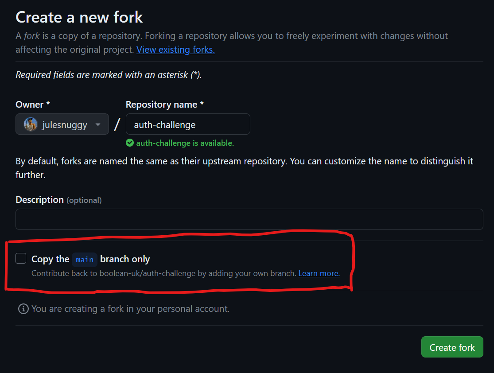

# Authentication Challenge

## Learning Objectives

- Use a token-based approach to authorise access to API resources
- Use a hashing library to encrypt sensitive information
- Build a front-end application that interacts with a bearer-auth protected API

## Introduction

You are tasked with building a small frontend application containing 3 forms and a list. There is a screenshot at the
bottom of this document that gives you an idea of what to aim for. As you'll be able to see, it doesn't have to *look*
good so don't spend time on styling!

The flow of the application you build looks like this:

1. A user fills in the register form to create their account with a hashed password
2. The user fills in the login form to get a bearer token
3. The user can then create movies once they have a valid token
4. The list of displayed movies will update as a user creates them

## Setting up

Take a little bit of time to familiarise yourself with the project structure - this exercise has both a front-end React
app (`src/client/`) *and* a back-end express API (`src/server/`) in it.

1. Fork this repository and clone the fork.
    1. If you want to use the more challenging `freedom` branch, remember to UNCHECK the checkbox for "Copy the 
       `main` branch only"

       </img>
    2. Then, once you have cloned your fork of the repo, you can run `git checkout freedom` in your terminal.
    3. If you do not uncheck this box, then you will only be able to access the `main` branch.
2. Rename `.env.example` to `.env`
3. Edit the `DATABASE_URL` variable in `.env`, swapping `YOUR_DATABASE_URL` for the URL of the database you just
   created. Leave `?schema=prisma` at the end.
4. Edit the `SHADOW_DATABASE_URL` variable in `.env`, swapping `YOUR_SHADOW_DATABASE_URL` for the URL of a shadow
   database you created in an earlier exercise. Leave `?schema=shadow` at the end.
5. Run `npm ci` to install the project dependencies. 
6. We have already created the Prisma schema and migrations for you. Run `npx prisma migrate reset` to execute the 
   database migrations. Press `y` when it asks if you're sure.

## Instructions

- Run the app with `npm run dev` - this will open a React app in your browser *and* run the express server at the 
  same time. This is thanks to the `concurrently` package that we have included in this project.
- The frontend React app will run on Vite's default port, which is usually `5173` - check the terminal once you have
  started the app to see what port it is running on.
  - If you have other Vite apps running, then this port could be different.
- The server will run on port `4000` (as set in `.env.example` - remember to create your own `.env` file). If you need 
  to, you can change this by updating the `VITE_PORT` environment variable in your `.env`.
  - Note: This environment variable is used in both the server and the client. Vite requires environment variables 
    to be prefixed with `VITE_`, so do not change the name! Read more about environment variables in Vite 
    [here](https://vitejs.dev/guide/env-and-mode.html#env-files).
- Work through each file in the `requirements` directory in numerical order. You can choose whether to work on the
  Client or Server version of each requirement first, but you may find it easier to do Server first.

## Example solution

